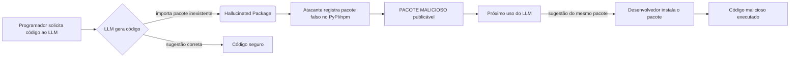

# Sumário executivo

O artigo de *Socket Labs* “The Rise of Slopsquatting…” (Sarah Gooding, 8 Abr 2025) introduz **slopsquatting** – um novo vetor de ataque na cadeia de suprimentos de software baseado em “alucinações” de LLMs. Em suma, ferramentas de assistência de código (Copilot, ChatGPT etc.) podem sugerir nomes de pacotes que não existem; um atacante pode então registrar esse nome fictício num repositório (PyPI, npm, etc.) e, se o desenvolvedor confiar cegamente na sugestão do AI, instalar o pacote malicioso. Gooding resume dados de um estudo de Spracklen et al. (preprint de USENIX 2025) em que 16 modelos de geração de código (GPT-4/3.5, CodeLlama, Mistral etc.) produziram 576 mil trechos de Python/JavaScript, dos quais **19,7% dos pacotes recomendados eram inexistentes**. Além disso, LLMs de código abertos tiveram ~21,7% de “alucinações” (vs 5,2% em comerciais) e foram gerados **mais de 205 mil nomes únicos falsos**. Esses padrões não são esporádicos: repetições mostram que 58% das alucinações ocorriam mais de uma vez em 10 execuções, facilitando que invasores identifiquem nomes confiáveis para registrar. Ressalta-se que muitos desses nomes fictícios são **plausíveis** (apenas 13% simples erros de digitação, 38% moderadamente similares a nomes reais). Por fim, a pesquisa testou mitigação: técnicas como *Retrieval-Augmented Generation* (fornecer base de dados de pacotes reais) e *fine-tuning* reduziram drasticamente alucinações (ex.: modelo DeepSeek de 16,1% → 2,66% de falsos pacotes), mas com custo em qualidade de código (pass@1 caiu de 51,4% para 25,3%). Gooding conclui que slopsquatting é um risco sério e crescente: à medida que “vibe coding” (descrever o que quer em vez de digitar código) vira padrão, desenvolvedores podem instalar dependências nunca verificadas. Como contramedidas, cita-se a necessidade de ferramentas de detecção e triagem de pacotes desconhecidos antes da instalação.

## Autores, data e contexto

O post “The Rise of Slopsquatting…” foi escrito por **Sarah Gooding** e publicado em 8 de Abril de 2025 no blog de segurança da *Socket Labs*, uma empresa de segurança de código. É uma reportagem técnica (7 min de leitura) que sintetiza resultados de pesquisa acadêmica (especialmente Spracklen et al., arXiv mar 2025) sobre segurança de código gerado por IA, mas **não é um paper acadêmico revisado**. Trata-se de comunicação de produto (“security news”) voltada a desenvolvedores e profissionais, vinculada ao novo programa de acesso confiável da OpenAI. Gooding contextualiza o tema no panorama atual: LLMs (Copilot, ChatGPT, etc.) estão difundidos nos fluxos de trabalho de desenvolvimento, trazendo ganhos de produtividade mas também riscos inéditos. O post se baseia em artigos científicos (por exemplo, o estudo “We Have a Package for You!”, Spracklen et al. 2025) e tendências da comunidade (especialmente o termo “slopsquatting” cunhado por Seth Larson e Andrew Nesbitt).

## Definição de slopsquatting e modelo de ameaça

**Slopsquatting** é definido como o registro proativo de um pacote **inventado por um LLM**. Em vez de depender do erro humano (como no *typosquatting*), o atacante explora o erro da IA. O fluxo de ataque típico é:

 
1. **Geração de código**: o desenvolvedor pede ao LLM um trecho de código (e.g. “usar a biblioteca X para fazer Y”).  
2. **Hallucinação**: o LLM “alucina” um nome de pacote (p.ex. `limiterXyz`) que parece plausível mas não existe nos repositórios públicos.  
3. **Registro pelo atacante**: ciente das tendências da IA, o atacante monitora saídas de LLMs ou sabe de prompts comuns e registra `limiterXyz` no PyPI/npm, possivelmente publicando uma versão com malware.  
4. **Instalação pelo desenvolvedor**: o desenvolvedor aceita a sugestão sem verificar (o mais comum em “vibe coding”) e instala o pacote.  
5. **Comprometimento**: o pacote fake contém código malicioso (ex.: criptomineração, *backdoor*), efetivando o ataque à cadeia de suprimentos.  

Esse modelo assume que o desenvolvedor confia no AI sem checar nomes de pacote e que o custo de registrar um pacote falso é baixo. É um tipo de *ataque por confusão de dependência* (assim como *dependency confusion* e *typosquatting*), mas especificamente motivado por falhas de LLM. O artigo enfatiza que muitas vezes o desenvolvedor nem digita o nome do pacote manualmente: em fluxos de “vibe coding”, a IA sugere o nome e o usuário instala no “piloto automático”. Nesse cenário, nomes fictícios plausíveis tornam-se vetores invisíveis de ataque e dificilmente são revistos antes da instalação.  

## Exemplos e evidências apresentadas  
O artigo de Gooding não fornece exemplos concretos de pacotes slopsquatting já ocorridos, mas baseia-se em experimentos controlados que simulam o risco. Cita a pesquisa de Spracklen et al. (2025), que coletou **576.000 trechos de código** gerados por 16 LLMs distintos em tarefas de programação realistas. Desses, **19,7% dos pacotes recomendados eram fictícios**. Modelos open-source “sem caixinha preta” (CodeLlama, DeepSeek, WizardCoder, etc.) alucinaram em média ~21,7% dos casos, enquanto modelos comerciais (GPT-3.5, GPT-4 Turbo) foram muito melhores (~5,2% em média). Os *“piores infratores”* (CodeLlama 7B/34B) hallucinaram mais de 33% das vezes, ao passo que o melhor (GPT-4 Turbo) teve apenas 3,59%. Além disso, encontraram **205 mil nomes únicos falsos** nas saídas – indicando que não se tratava de erros aleatórios repetidos, mas de padrões sistemáticos.

A persistência dessas falhas foi estudada repetindo prompts problemáticos várias vezes. Descobriu-se que **43% das alucinações reapareciam em TODAS as 10 execuções repetidas do mesmo prompt**, enquanto 39% nunca mais retornavam. Resumidamente, 58% dos nomes falsos surgiam mais de uma vez em 10 tentativas. Essa consistência bimodal sugere que muitos nomes “inventados” viram artefatos repetíveis, o que facilita o trabalho de atacantes: poucos exemplos do comportamento do modelo são suficientes para identificar bons candidatos a slopsquatting.

Outras descobertas relevantes:  
- **Temperatura e verbosidade**: LLMs operando com *temperatura* alta (saídas mais “criativas”) geraram mais nomes falsos. Modelos “verbosos” (que sugerem muitos pacotes diferentes) tiveram taxas de alucinação maiores do que modelos mais conservadores.  
- **Nome plausível**: Uma parte significativa das sugestões falsas tem nomes parecidos com pacotes reais (38% de similaridade moderada). Só 13% eram erros triviais de digitação; quase metade eram nomes totalmente “inventados” mas ainda naturais de ler. Isso dificulta a detecção manual por desenvolvedores.  
- **Confusão entre ecossistemas**: 8,7% dos pacotes “alucinações” sugeridos para Python coincidiram com nomes válidos do npm (JavaScript), indicando que modelos por vezes confundem contextos linguísticos. Quase nenhuma sugestão falsa se baseava em pacotes apagados (0,17% em PyPI), confirmando que a maioria dos nomes era completamente inventada.  
- **Autodetecção de IA**: Modelos avançados (GPT-4 Turbo, DeepSeek) podiam detectar internamente ~75% dos nomes falsos que eles mesmos haviam gerado, abrindo caminho para *autoverificação* como mitigação.

Esses resultados são acompanhados de figuras ilustrativas (provenientes de Spracklen et al.) mostrando comparações, histogramas e exemplos de prompts. O artigo ressalta que **TODO esse experimento foi feito sem nunca publicar nenhum dos pacotes falsos** (por ética/segurança), focando apenas na análise em larga escala. Em resumo, a evidência técnica indica que a alucinação de pacotes é comum, repetível e difícil de distinguir por humanos, tornando viável o ataque de slopsquatting.  

## Metodologia dos autores  
O estudo, base do artigo, usou a seguinte abordagem (resumindo o que Gooding relata):  
- **Gerar código realista**: Construíram *dois grandes conjuntos de prompts*: um vindo de perguntas do StackOverflow, outro a partir de descrições dos pacotes mais baixados no PyPI/npm. Exemplos de tarefas incluíam “gerar código Python que use Selenium para automação web”, “implemente um rate limiter com a biblioteca ‘limiter’”, etc. Esses prompts refletem consultas reais de desenvolvedores.  
- **Modelos testados**: 16 LLMs de ponta foram usados – tanto comerciais (GPT-4, GPT-3.5) quanto open-source (CodeLlama, DeepSeek, WizardCoder, Mistral, etc.). Cada modelo gerou saídas para os 576.000 prompts, em Python e JavaScript, com condições controladas (sem ajustes extremos de parâmetros além dos cenários do estudo).  
- **Detecção de alucinações**: Na saída de cada modelo, procurou-se por imports ou instruções `pip/npm install` de pacotes. Se o nome do pacote não existia no repositório oficial (verificado em tempo de pesquisa), foi considerado um caso de *package hallucination*. Acrescentaram tratamento especial para nomes similares a pacotes reais (para aferir semelhança) e checaram se corresponderam a pacotes deletados (muito raro).  
- **Repetições e parâmetros**: Para testar robustez, prompts que geravam alucinações foram repetidos 10 vezes cada, revelando a persistência das falhas. Também variaram parâmetros de geração, como *temperatura*, e analisaram modelos “precavidos” vs “criativos”.  
- **Simulação ético-seguridade**: Importante: *nenhum* pacote alucinado foi realmente registrado ou publicado pelos pesquisadores, evitando afetar repositórios públicos. Eles focaram apenas em simular e medir o risco.  

**Limitações**: os resultados são de *cenários controlados* – embora baseados em prompts realistas, não substituem um teste de longo prazo em projetos reais. Por exemplo, modelos e data sets evoluem rápido, e testes refletiam versões disponíveis até 2024. Ademais, comportamentos reais de desenvolvedores (verificação ou não de pacotes) foram inferidos, não medidos. Porém, a escala (576k exemplos) dá alta validade interna aos achados: padrões repetidos indicam um fenômeno sistêmico nas respostas dos LLMs.  

## Mitigações propostas e avaliação de viabilidade  
Spracklen et al. exploraram várias contramedidas técnicas para reduzir alucinações, destacando três principais: *Retrieval-Augmented Generation* (RAG), *auto-refinamento* e *fine-tuning* supervisionado. As linhas gerais de cada abordagem são:  

- **RAG (Base de Conhecimento)**: antes de gerar código, o prompt é enriquecido com uma lista de pacotes reais relevantes (e.g. nomes extraídos da base PyPI/npm). Assim, o modelo tem informações para evitar inventar nomes. Resultado: reduziu alucinações (modelo DeepSeek caiu de 16,14% para 12,24% falsos pacotes). É uma estratégia prática (pode ser integrada a IDEs ou APIs), mas depende de manter uma base atualizada de pacotes confiáveis.  
- **Auto-refinamento (Self-Refinement)**: após gerar código inicialmente, o modelo é solicitado a revisar suas próprias importações para validar ou corrigir eventuais erros. Teoricamente, alguns LLMs conseguem identificar suas próprias alucinações (até ~75% em GPT-4). No estudo, o self-refinement teve impacto moderado: DeepSeek melhorou de 16,14% para 13,04% (redução de ~19%). A vantagem é não requerer dados externos, mas a eficácia varia muito por modelo.  
- **Fine-Tuning supervisionado**: treinar/fazer *fine-tune* o modelo com exemplos que penalizam saídas falsas. Em experimentos, o fine-tuning foi o mais eficaz: no modelo DeepSeek reduziu alucinações para apenas **2,66%** (de 16,14% baseline), e o ensemble de múltiplas técnicas chegou a 2,40%. No entanto, isso custou muito à qualidade do código: o *pass@1* no benchmark HumanEval caiu de 51,4% para 25,3%. Em outras palavras, o modelo aprendeu a não inventar pacotes, mas ficou pior em gerar código correto.  

Além disso, o artigo sugere mitigações gerais de segurança de dependências:  
- **Controle de dependências**: por exemplo, só permitir a instalação de pacotes já publicados ou de um whitelist, bloqueando automaticamente nomes desconhecidos. Mas isso pode impedir pacotes legítimos novos e requer curadoria contínua.  
- **Ferramentas de SCA (Software Composition Analysis)**: escanear automaticamente dependências recém-escolhidas em busca de comportamento suspeito. O próprio blog promove o produto Socket: “nossa plataforma escaneia cada pacote, sinaliza scripts de instalação, código ofuscado, payloads ocultos” e bloqueia antes de entrar em produção. Ferramentas assim podem detectar pacotes maliciosos mesmo publicados, mitigando o impacto caso um hallucinated seja instalado inadvertidamente.  
- **Educação e validação**: treinar desenvolvedores para questionar sugestões de IA (“será que o pacote existe mesmo?”) e sempre consultar registries oficiais. Por exemplo, ao notar um nome sugerido pela IA, pesquisar manualmente no npm/PyPI antes de instalar.  

Na prática, cada mitigação tem trade-offs. RAG e self-refinement mostram-se promissoras sem degradar muito a funcionalidade, mas exigem engenharia extra (acesso a bases externas, etapas adicionais de prompt). Já o fine-tuning severamente afeta utilidade geral do LLM (e seria custoso para cada organização realizar isso em seus modelos). Há também riscos de “inserir no prompt” (pode atrapalhar o contexto) e a necessidade de atualizar continuamente a base de pacotes. Em suma, não há solução trivial: é preciso combinação de técnicas de ML com medidas tradicionais de segurança. Spracklen et al. concluem que mitigações existentes reduzem significativamente as alucinações, mas **ficam defasadas em novos modelos** sem reavaliação continuada.  

## Mitigações versus passos do ataque  

| Etapa do ataque       | Descrição em slopsquatting                                      | Contramedidas/Técnicas de defesa                                         |
|-----------------------|-----------------------------------------------------------------|---------------------------------------------------------------------------|
| 1. Sugestão de pacote | LLM gera import de pacote inexistente (alucinação) | **Prompt segurizado**: instruir o LLM a checar pacotes, usar RAG (base atual) |
| 2. Registro malicioso| Atacante cadastra pacote alucinado em repositório (PyPI/npm)    | **Monitoramento de publicações**: ferramentas alertam admins quando novos pacotes com nomes suspeitos são publicados. |
| 3. Instalação pelo dev| Dev instala pacote falso sugerido pela IA (ex.: “pip install”)  | **SCA/whitelist**: bloquear automaticamente instalação de pacotes não listados ou de origem duvidosa. |
| 4. Execução maliciosa| Código malicioso do pacote é executado no ambiente do dev/prod  | **Scanner de pacotes**: executar análise estática em tempo de CI/CD, detectar payloads ocultos antes de deploy. |

Cada contramedida tem limitações. Por exemplo, exigir whitelist gera sobrecarga administrativa; análise de cada novo pacote pode criar falsos-positivos; RAG exige manter base própria de pacotes e integrar ao IDE. Uma estratégia combinada é recomendada: usar o modelo em modo seguro (prompt engineering), mas também reforçar segurança tradicional de dependências (ferramentas de SCA como Socket, políticas de publicação de código, etc.). 

## Implicações de segurança e recomendação  
O fenômeno do slopsquatting amplia as vulnerabilidades da cadeia de suprimentos de software. Tradicionalmente, ataques como *typosquatting* ou *dependency confusion* já eram vetores explorados; agora a IA gera um terceiro modo de confusão. Em ambientes modernos onde “vibe coding” predomina, muitos desenvolvedores confiam cegamente no output da IA. Isso exige mudanças práticas e políticas: 
- **Ferramentas de desenvolvimento** devem sinalizar automaticamente pacotes desconhecidos. IDEs ou extensões podem oferecer verificações em tempo real (ex: alertar “pacote não encontrado no registro oficial”).  
- **Repositórios de pacotes** podem adotar políticas de registro mais rígidas (p.ex. quarentena, tags de verificação), embora haja trade-offs.  
- **Equipes de segurança** devem atualizar fluxos de trabalho de SCA para incluir detecção de “novos pacotes” publicados e monitorar pacotes de baixo uso. A recomendação do artigo – usar proteções como o *Socket Firewall* – ilustra esse caminho.  
- **Legislação e normas** ainda não contemplam diretamente ataques de IA, mas órgãos reguladores de software devem considerar diretrizes para uso seguro de IA em desenvolvimento, assim como já existem orientações para signed builds e cadeia de confiança.  

Finalmente, o artigo identifica várias **questões em aberto**: Como treinar ou alinhar modelos futuros para reduzir alucinações sem sacrificar performance? Quais métricas de confiança devem ser apresentadas ao desenvolvedor (por exemplo, “o modelo não tem certeza deste pacote”)? Como estudar o comportamento de equipes reais ao usar IA (será que revisarão dependências ou confiarão cegamente)? Há espaço para pesquisa de *detecção automática de alucinações* e de *educação do usuário*. Para a comunidade acadêmica, explorar novos benchmarks de segurança de código gerado e integrar modelos mais atuais (GPT-5 e afins) são tarefas urgentes.  

## Conclusões e recomendações práticas  
Em conclusão, o post da Socket e o estudo por trás dele demonstram que **a automação por IA traz riscos reais de segurança** que vão além dos bugs de código: ao “inventar” dependências, LLMs podem inadvertidamente introduzir malwares na cadeia de suprimentos. Ainda que em muitos cenários o impacto prático dependa do comportamento do desenvolvedor, as estatísticas são claras: **quase 1 em cada 5 sugestões de pacote de certos modelos é falsa**. Em face disso, recomenda-se:  
- **Desenvolvedores**: verificarem nomes de pacotes sugeridos por IA antes de instalar. Se o IDE sugerir um pacote não reconhecido, pesquise no PyPI/npm ou peça ao AI confirmação. Não instale apenas por conveniência. Ferramentas de linting podem ser configuradas para alertar sobre novos pacotes.  
- **Manutenção de plataforma**: repositórios (PyPI/npm) podem monitorar termos frequentemente “alucinados” e reagir (bloquear scammers, notificar time de segurança). Equipes de DevSecOps devem tratar ‘problemas de cadeia de suprimentos induzidos por IA’ como uma nova classe de vulnerabilidade.  
- **Pesquisadores e ferramenta/LLM builders**: integrar mecanismos de detecção de hallucination e fontes de verdade externas (RAG) nos modelos de código. Desenvolver benchmarks de segurança de código gerado que incluam ataques de slopsquatting. Investigar como diferentes arquiteturas de LLM ou finetunings afetam esse problema. Além disso, continuar estudos de usuário para medir o comportamento real dos devs frente a essa ameaça.  

Em síntese, o slopsquatting não é apenas um trocadilho clever, mas uma ameaça emergente real. A análise conjunta de Gooding/Spracklen indica que **ignorar as sugestões de pacotes de IA é uma estratégia sábia até termos melhores soluções automáticas**. A arma final contra esses ataques é a vigilância – tanto automatizada (ferramentas de análise de dependências) quanto humana (auditar sugestões da IA). Ferramentas avançadas que bloqueiem dependências suspeitas (como as mostradas pela Socket) serão essenciais para mitigar riscos enquanto a pesquisa em IA seguras avança.

**Fontes principais:** o próprio post da Socket e o preprint de Spracklen et al. (2025), além de estudos acadêmicos de Pearce et al. (2022), Perry et al. (2023) e Chen et al. (2021) que contextualizam os riscos da geração de código inseguro.  Cada dado e recomendação acima foi respaldado por esses estudos ou pelo próprio post, conforme citado.