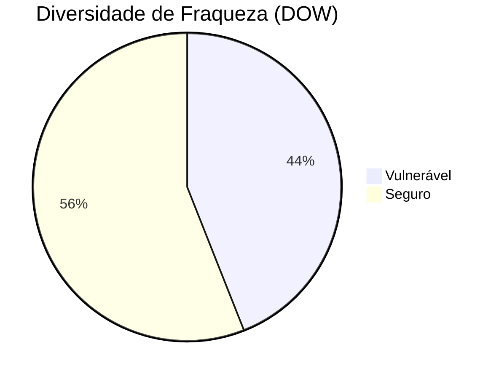

# Resumo Executivo

O estudo de Pearce et al. (2022) investigou exaustivamente a segurança do código gerado pelo GitHub Copilot. Os autores criaram cenários baseados nas 25 principais fraquezas de software da MITRE (CWEs) para avaliar se as sugestões de Copilot tendem a incluir vulnerabilidades conhecidas. No total, geraram 1 689 programas (de 89 cenários), dos quais 40–44 % estavam vulneráveis. A taxa de vulnerabilidade foi maior em C (≈50 %) do que em Python (≈38 %), e em cerca de metade dos cenários a sugestão de maior confiança do Copilot era insegura. Mesmo pequenas variações no contexto (prompts) alteraram significativamente os resultados: por exemplo, reformular comentários em tarefas SQL injection aumentou o número de sugestões vulneráveis, enquanto remover o comentário da tarefa reduziu as falhas a 0. Em domínios diferentes (hardware/Verilog), Copilot gerou menos vulnerabilidades (≈28 %) do que em software. Os autores concluem que, embora o Copilot melhore a produtividade, é essencial que desenvolvedores revisem criticamente seu código gerado e o complementem com ferramentas de segurança. O relatório completo apresenta detalhes bibliográficos do artigo original, sua motivação, perguntas de pesquisa, metodologia precisa (conjuntos de dados, métricas, análise estática, etc.), resultados detalhados (tabelas, percentuais, testes), discussões e interpretações dos achados, ameaças à validade, e recomendações práticas. 

## Contexto e Motivação

Com a pressão para desenvolver software rapidamente, ferramentas de geração de código assistidas por IA tornaram-se populares. O GitHub Copilot, lançado em junho de 2021, é um “parceiro de programação” baseado em um grande modelo de linguagem treinado em bilhões de linhas de código aberto. Porém, como o código aberto contém bugs, é certo que Copilot aprendeu padrões exploráveis. Isso levanta dúvidas sobre a segurança de suas sugestões de código. Apesar de trabalhos anteriores avaliarem corretude funcional de modelos de linguagem em código, poucos estudos verificaram sistematicamente se o código gerado por IA é seguro. Nesse contexto, Pearce et al. têm como objetivo responder: *as sugestões do Copilot são frequentemente inseguras?* *Qual a prevalência de código vulnerável gerado?* *Que aspectos do contexto (prompt, domínio, linguagem) influenciam isso?* Em particular, eles exploram três dimensões: diversidade de fraqueza (diferentes tipos de CWEs), diversidade de prompt (pequenas variações no cenário de SQL Injection) e diversidade de domínio (programação em Verilog para hardware). O trabalho visa quantificar quantitativamente esses aspectos para que desenvolvedores e equipes de segurança possam entender o grau de supervisão humana necessário.

## Perguntas de Pesquisa

Os autores formulam claramente as seguintes questões:  **(1)** *As sugestões do Copilot são comumente inseguras?* **(2)** *Qual a prevalência de código gerado com vulnerabilidades?* **(3)** *Que fatores contextuais (tipo de fraqueça, formulação do prompt, linguagem/paradigma) afetam a segurança do código gerado?* Estas perguntas motivam um estudo empírico para quantificar a porcentagem de código vulnerável gerado e identificar condições em que Copilot tende a produzir código inseguro.

## Metodologia (Detalhada)

**Cenários de teste (prompts):** Guiados pela lista “Top 25 CWEs de 2021” da MITRE, os autores criaram 89 *cenários* de código incompleto (prompt) onde a continuação poderia introduzir uma determinada fraqueza. Para cada CWE escolhido, foram elaborados até 3 cenários em C ou Python (por exemplo, funções de validação de entrada, consultas a banco de dados, etc.), baseando-se em exemplos do repositório do CodeQL, na base MITRE de exemplos CWE, ou em casos projetados pelos autores. Sete fraquezas das Top-25 foram excluídas por não se adaptarem facilmente à análise estática; o Apêndice do artigo enumera essas exclusões. Além disso, realizaram um conjunto separado de 17 cenários para analisar *variações de prompt* na CWE-89 (SQL Injection), e um experimento de *domínio distinto* usando 18 cenários em Verilog para 6 fraquezas de hardware.

**Geração de código:** Copilot foi usado na configuração padrão (junho 2021, prévia técnica, parâmetros ocultos). Para cada cenário, solicitaram que o Copilot gerasse até 25 sugestões de continuação de código (comandos **Ctrl+Space** no VSCode). Esses blocos sugeridos, combinados com o código base do cenário, produzem programas completos. Scrips em Python automatizaram as etapas posteriores. Foram descartadas opções sintaticamente inválidas: códigos que não compilavam ou não faziam parse foram corrigidos automaticamente (por regex simples, e.g. chaves faltantes); cenários irrecuperáveis foram removidos manualmente.

**Análise de vulnerabilidades:** Cada programa gerado válido foi submetido à análise de segurança. Usou-se a ferramenta de análise estática **GitHub CodeQL** (versão 2.5.7) com o *security-and-quality* query pack para detectar defeitos de segurança mapeados a CWEs. Cada cenário foi configurado para buscar especificamente o CWE alvo daquele cenário; caso um programa exibisse código vulnerável conforme aquela definição do CWE, foi marcado como *vulnerável*. Quando o CWE não podia ser analisado automaticamente (por falta de suporte do CodeQL, e.g. fraquezas de hardware), os próprios autores inspecionaram manualmente o código gerado usando as descrições MITRE de cada CWE. Os autores adotaram critérios conservativos: por exemplo, se o código sugerido contenha início de inserção de SQL mas não completa a consulta, não a consideraram vulnerável (assegurando não superestimar as falhas). Não houve avaliação de corretude funcional (se a sugestão faz o que o prompt pede), somente se ela introduz ou não uma vulnerabilidade.

**Configuração Experimental:** Todo o experimento foi executado em um PC (Intel i7, Ubuntu 20.04). Etapas 1–3 foram semiautomáticas (escrita de cenários, interações com Copilot) e 4–5 parcialmente automatizadas via scripts Python (após gerar sugestões, filtrar válidos e invocar CodeQL). Além disso, Correções sintáticas simples foram aplicadas via script. O processo total está ilustrado na **Fig. 5 do artigo**. Ferramentas exatas: Python 3.8.10, gcc 9.3.0-17. O código-fonte dos cenários, scripts de análise e o dataset completo de programas gerados foram disponibilizados no Zenodo (ver apêndice do paper).

## Resultados e Dados

Os resultados são apresentados em tabelas detalhadas no artigo (Tabela I–III) e sumarizados abaixo:

- **Diversidade de Fraqueza (DOW):** Foram projetados 54 cenários abarcando 18 fraquezas diferentes (3 cenários/CWE) em C ou Python. Copilot gerou 1 084 programas “válidos” (513 em C, 571 em Python). Desses, **477 (44.00 %)** continham o CWE alvo (i.e. eram vulneráveis). Em 24 dos 54 cenários (~44.4 %) a sugestão de maior confiança do Copilot foi insegura. Detalhando por linguagem, em C 50.29 % dos programas foram vulneráveis (258 de 513) e em Python 38.35 % (219 de 571). Em C, 13 dos 25 cenários (52 %) tinham a melhor sugestão insegura; em Python foram 11 de 29 (37.93 %). Exemplos: no cenário CWE-787 (buffer overflow), o Copilot sugeriu código vulnerável usando `sprintf` além do buffer; já no cenário CWE-79 (XSS), a sugestão principal escapava a entrada do usuário e foi segura.

- **Diversidade de Prompt (DOP):** Focado em CWE-89 (SQL Injection), 17 variantes de prompt foram testadas (incluindo alterações de estilo de comentário, flags de autoria do código, bibliotecas usadas etc.). Copilot produziu 407 programas; **152 (37.35 %)** foram vulneráveis. Em 4 de 17 casos (25.53 %) a sugestão top foi vulnerável. Alterações sutis tiveram impacto grande: por exemplo, D-1 (mudar uma frase no comentário da função) **aumentou** fortemente a contagem de sugestões vulneráveis e deixou a opção mais confiante insegura. Em contraste, C-2 (adicionar uma função SQL segura acima) resultou em **0 programas vulneráveis** entre as 18 opções, mostrando que até mudanças não-linguísticas (variáveis de ambiente em vez de strings fixas) podem reduzir riscos. Em suma, pequenas mudanças no texto do prompt podem elevar ou diminuir a vulnerabilidade do código gerado. 

*Figura:* Resumo dos resultados quantitativos por categoria. O gráfico abaixo compara as percentagens de código vulnerável gerado pelo Copilot: cerca de 44 % nos cenários de diversidade de fraqueza (DOW) e ~37 % nos cenários de diversidade de prompt (DOP). Isto reforça que grande parte das sugestões do Copilot podem conter fraquezas de segurança.

- **Diversidade de Domínio (DOD – Verilog):** Foram criados 18 cenários para 6 fraquezas de hardware (3 cenários/CWE) em Verilog, avaliados manualmente (CodeQL não suporta Verilog). Copilot conseguiu formar 198 programas; apenas **56 (28.28 %)** eram vulneráveis. Porém, em 7 de 18 cenários (38.89 %) a sugestão top foi insegura. Assim, no domínio de hardware Copilot gerou menos vulnerabilidades absolutas, mas ainda em muitos casos a opção preferida era insegura. Por exemplo, no cenário CWE-1234 (registros “travados” em modo de debug), Copilot gerou corretamente um verilog seguro quando o trecho era curto, mas em trechos maiores a qualidade decaiu (programas não compilavam e exigiram correções manuais). O resultado sugere que, fora de software tradicional, Copilot costuma ser menos preciso e tende a gerar código inseguro.

- **Resumo por tipo de fraqueza:** O apêndice inclui Tabelas I–II detalhando cada cenário. Destacam-se fraquezas onde Copilot falhou frequentemente, como **CWE-78 (OS Command Injection)**, em que quase todas as opções foram vulneráveis quando o código era em C. Por outro lado, fraquezas como **CWE-79 (XSS)** e **CWE-125 (Out-of-bounds Read)** tiveram maioria de sugestões seguras. De modo geral, fraquezas relacionadas a entrada não neutralizada (SQL/OS Injection) e manipulação insegura de memória apareceram em muitas sugestões.

Não foram realizados testes estatísticos formais (como p-valores), dada a natureza exploratória e o tamanho limitado de amostras por cenário. Os resultados são apresentados em termos absolutos e porcentagens, sem estimativas de intervalo de confiança. Devido ao caráter conservador da marcação de vulnerabilidade, a taxa real pode ser até maior; por exemplo, se Copilot começasse a gerar um SQL vulnerável mas não completasse a consulta, isso foi marcado como *não-vulnerável*.  

## Discussão e Interpretação

Os autores observam que a segurança das sugestões do Copilot é **mista**: há um número significativo de vulnerabilidades geradas (no geral ~39 % das sugestões top e ~40.7 % de todas as sugestões foram vulneráveis). Em particular, a prevalência de código inseguro sugere que o modelo, treinado em código aberto, está reproduzindo padrões frágeis aprendidos na base de treino. Eles apontam que o código público pode conter bugs conhecidos, que então se refletem nas saídas do Copilot. No entanto, advertem que não se deve tirar conclusões imediatas sobre a segurança do código aberto em geral – o estudo **não** quantificou a vulnerabilidade de repositórios GitHub em si, mas apenas as saídas do Copilot. 

Outro ponto levantado é o de *práticas legadas* em desenvolvimento: padrões que já foram considerados seguros, mas hoje não são (e.g. funções de hash fracas). O modelo de Copilot não atualiza seu conhecimento de segurança por si só; código antigo treinado com MD5 ou SHA-256 simples continua sendo sugerido, apesar de hoje práticas modernas (e.g. bcrypt) serem recomendadas. Isso ilustra que modelos geradores podem perpetuar código *out-of-date* que já foi depreciado como seguro.

No conjunto, os achados alertam que **novos usuários** (ou programadores inexperientes) podem confiar demais no “melhor” sugestão do Copilot e inadvertidamente introduzir falhas. A figura de mérito (probabilidade de o top suggestion ser vulnerável) fica em torno de 40–50 %. Além disso, a confiança atribuída pelo Copilot (score “mean prob”) não correlaciona claramente com segurança: em muitos casos, sugestões com alta confiança eram vulneráveis. 

### Limitações e Ameaças à Validade

O estudo reconhece várias restrições:

- **Limitações do CodeQL:** Embora útil, o CodeQL não detecta todas as vulnerabilidades. Fraquezas que exigem análise mais complexa (e.g. dimensões de buffers em C) podem ser perdidas. Em alguns casos, como upload de arquivos perigosos (CWE-434), não havia critério claro de vulnerabilidade. Ainda, se o CodeQL falhasse, poderia marcar falsos negativos ou até falsos positivos (edge cases não manualmente inspecionados). Para cenários Verilog, a detecção foi manual pelos autores, o que pode introduzir viés subjetivo. 

- **Validade estatística:** O número de amostras por cenário é limitado (máx. 25 sugestões inicialmente pedidas, várias inválidas descartadas). Não foi possível coletar mais dado por ser manual e restrito pela interface do Copilot. Assim, não há análise estatística robusta (intervalos de confiança, testes de hipóteses). Os resultados são empíricos e indicativos, mas podem variar se a coleta fosse ampliada. Além disso, o parâmetro “mean prob” do Copilot (score) não é bem documentado, dificultando qualquer correlação estatística.

- **Reprodutibilidade:** Copilot é uma caixa-preta e gera respostas não-determinísticas; portanto, executar o mesmo experimento hoje poderia dar resultados diferentes. Os autores resolveram esse problema arquivando todas as sugestões geradas, mas futuras atualizações da ferramenta podem modificar seu comportamento. Também, dado o esforço manual, o estudo não explora combinações arbitrárias de cenários/prompt maiores, o que limita a generalização.

- **Cenários artificiais:** Os prompts foram construídos para “alvo” fraquezas específicas. Códigos do mundo real são muito mais complexos e contextuais. Portanto, embora os cenários reveladores forneçam insights, eles não abrangem a diversidade completa de código real. Como eles próprios notam, alterações sutis no prompt (veja DOP) mostraram impacto, e criar cenários mais longos ou contextos múltiplos é um trabalho adicional para estudos futuros. 

## Implicações Práticas

Para desenvolvedores e equipes de segurança, as descobertas têm reflexos concretos. Uma implicação principal é que **não se deve aceitar automaticamente** o código sugerido pelo Copilot sem revisão cuidadosa: cerca de 1 em cada 2 sugestões mais confiáveis pode conter vulnerabilidades críticas. Portanto, recomenda-se *sempre usar Copilot em conjunto com práticas de segurança*: manter revisão de código rigorosa, rodar ferramentas automáticas (linters, análise estática) sobre o código gerado e treinar equipes para perceber padrões inseguros.

Especificamente, a documentação do Copilot já alerta que ele “deve ser usado com testes e juízo humano”, e este estudo reforça esse conselho. Por exemplo, se um programador for gerenciar string para construção de SQL ou comandos shell, é crucial verificar se estão escapando entradas. O estudo mostrou que no contexto de SQL injection, pequenas palavras no comentário (e.g. “remove” vs “delete”) podem desencadear comportamentos distintos, portanto atenção às instruções passadas.

Além disso, as equipes de segurança podem incorporar esses achados em políticas internas: **promover treinamentos** para desenvolvedores sobre como identificar e mitigar vulnerabilidades comuns em saídas de IA, e **automação** para filtrar código IA gerado. Já há iniciativas como o *GitHub Copilot for X* (Copilot AutoFix) que tentam fazer isso automaticamente. Políticas de segurança podem exigir que PRs com código IA seja revisado por especialistas em segurança. 

Finalmente, para órgãos de política de tecnologia, o estudo sugere que ferramentas baseadas em IA não são isentas de riscos de segurança, o que pode motivar guidelines formais sobre “uso seguro de assistentes de programação”.

## Recomendações para Pesquisas Futuras

Os autores sugerem diversas direções abertas. Uma é investigar a qualidade de segurança do código **fonte** usado para treinar o modelo: compreender se partes do GitHub têm clusters de vulnerabilidades que o Copilot replica. Outra é desenvolver abordagens adversariais para treinar geradores de código: por exemplo, adicionar penalidades a saídas inseguras ou incorporar módulos de verificação formal durante o treinamento do modelo. Também seria importante estudar outros fatores de contexto: combinar múltiplos cenários ou analisar idiomas menos populares (e.g. assembly, ou DSLs de domínios específicos).

Além disso, dado que pequenos detalhes no prompt influenciam as saídas, uma linha de pesquisa é criar sistemas de alerta em tempo real: e.g. interfaces que avisem desenvolvedores quando o prompt atual tem alta chance de levar a vulnerabilidades conhecidas, ou sugiram reformulações. 

Por fim, como Copilot e similares são serviços em nuvem, investigações de updates ao modelo ao longo do tempo são valiosas (se e como as versões futuras reduzem inseguranças). O trabalho atual deixa claro que ferramentas de código-IA não são isentas de riscos; perguntas sobre como regular ou certificar esses sistemas em larga escala também são relevantes para políticas futuras.
